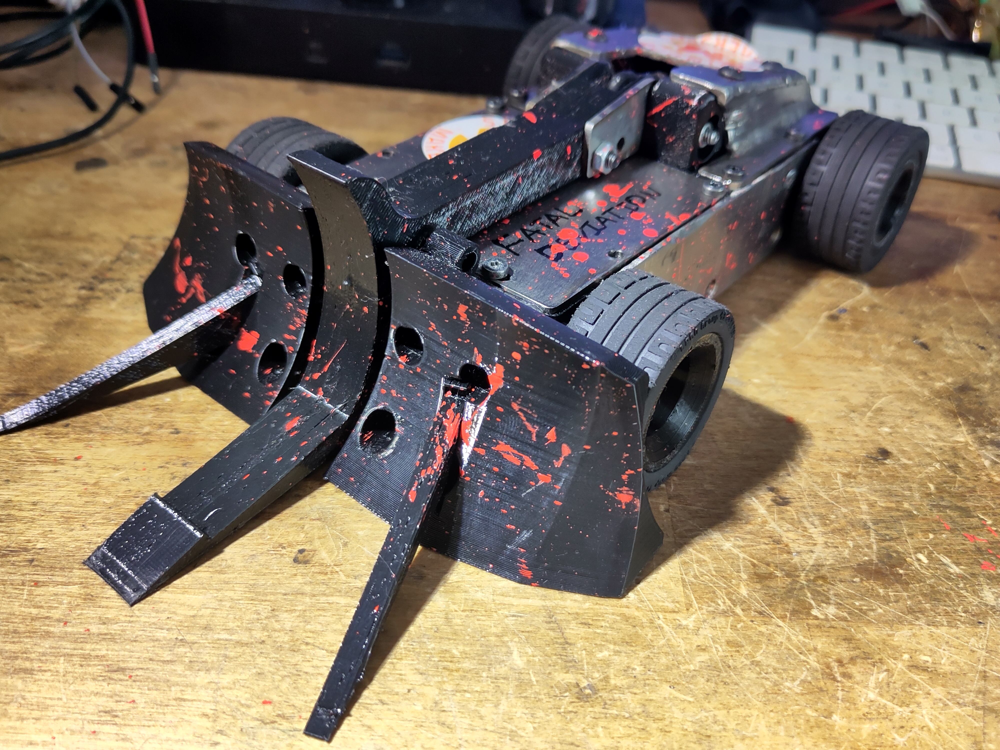
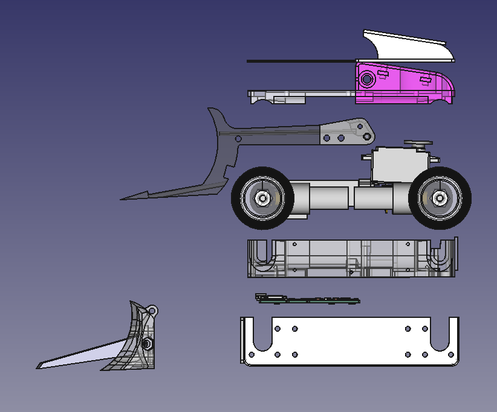
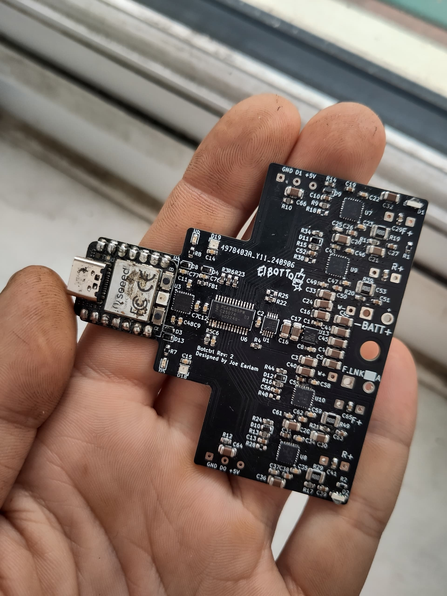
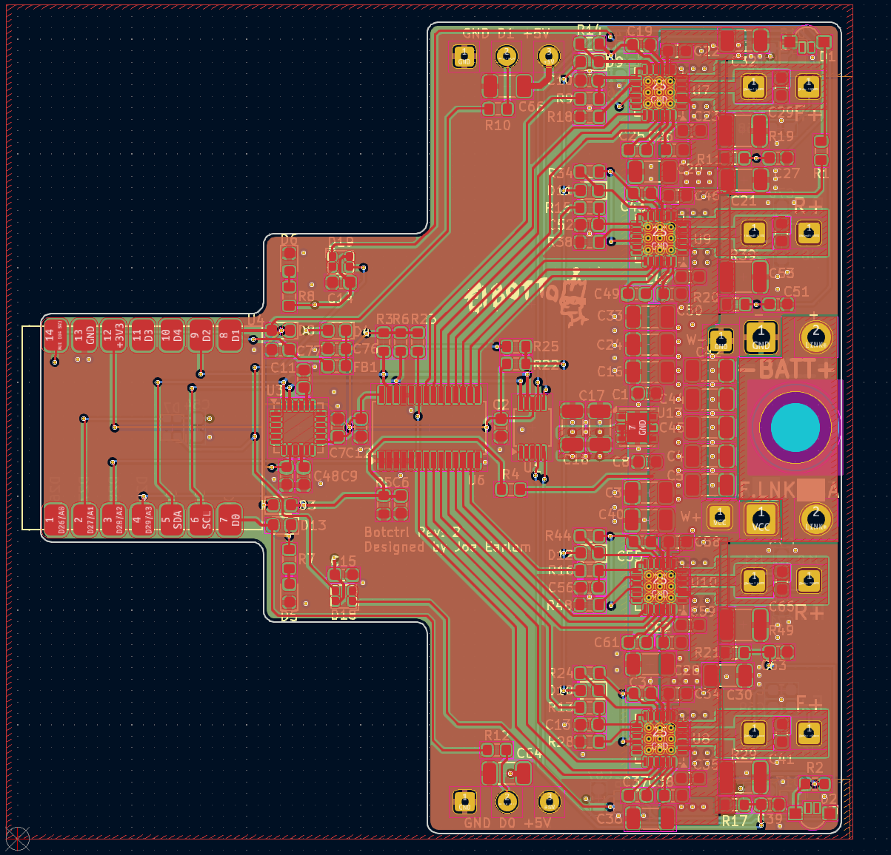

# Fatal Deviation

Fatal Deviation is my 1.5KG beetleweight lifter, with independent 4WD and electronic stability control. The name comes from Ireland's first full-length martial arts movie of the same name, which can be found in its entirety on youtube for the morbidly curious.

This repository is not intended to be instructional - this isn't a full open-source project, but a reference for myself and others who want to see how the sausage is made. If you do build your own (or something similar), please let me know, I'd love to see more weird tiny beetleweights on the scene!

The night before Bristol Bot Builders' Summer Showdown, July 2025

## Design Criteria and Overview

I impulse bought a TIG welder in Lidl and needed more excuses to use it. Somebody on the internet said that it wasn't possible to build a somewhat competitive beetleweight robot almost entirely from steel. Together, that was all the motivation I needed. Watching fast lifter/grappler bots like P1, Whiplash, Claw Viper/Red Storm, and having previous experience racing RC cars, I knew how I wanted the bot to drive - fast, agile, predictable. This gave me some design requirements:

* Extremely compact chassis to allow as much armour coverage as possible.
* Four independently controlled drive motors, for redundancy and torque vectoring.
* Small, compact and powerful lifter mechanism.
* As much RGB as possible while still having enough power left over for the bot to drive.

## Mechanical Design

The mechanical design uses a welded 304 stainless steel chassis tub - 2mm sides and bottom, with 4mm front and rear sections. Stainless was chosen for aesthetic reasons, and because 2mm hardox is very difficult to source.

The wedge is soft-mounted via threaded aluminium inserts pressed into TPU brackets. The tub protects a TPU clamshell that sandwiches the internal components together, via long screws and threaded inserts to pull it together. Self-tapping screws are used to hold the clamshell into the chassis tub which suspends all the internal components and hopefully provides some shock absorption.

The TPU clamshell design means all the internal components of the robot can be removed as a unit for repair on the bench. Accessing any component only takes a couple of minutes, although unfortunately due to the compact design many connections have to be soldered rather than connectorised/

## Electronic Design

The only way to cram electronics into the remaining space inside the bot is to integrate every function (aside from the receiver) into a single PCB. In approximately 50x70mm total board area, the PCB provides:

* Seeed Xiao RP2040 microcontroller
* 4x 6A drive channels (TI DRV8256P drivers), with current sensing.
* MPU6050 gyro + accelerometer
* IBUS receiver compatible
* Servo power and signal pads
* 7x WS2812 RGB LEDs

The four layer PCB was designed with heavy usage of copper pours, optimised to keep resistance (both electrical and thermal) and inductance as low as possible when using cheap 1oz copper fabrication processes (2oz often costs 3-4 as much as 1oz!). The design also keeps the hot and EMI-prone motor drivers and servo power pads far away from the sensitive IMU and MCU. While only supposed to run 2-3 minutes at a time for events, it's been stress tested with 5-10 minutes of continuous running and barely rises over 45c, even with no airflow and four hot motors spinning inside the bot.

## Software Design

The software is written in Arduino IDE, utilising both cores of the RP2040 microcontroller. The firmware uses the wonderful [TaskScheduler](https://github.com/arkhipenko/TaskScheduler) library by arkhipenko to handle timing and looping, with modularity provided by custom classes containing motor driver logic, IMU data processing, and drive maths. The task-based asynchronous code allows predictable timing for data acquisition and filter functions, while also optimising for minimum latency by triggering drive maths routines the instant that a new radio packet is received.

IMU gyroscope data is used, in combination with the steering channel data received from the RC transmitter, as the input and target variables of a PID loop, which provides the electronic stability control - the bot will steer to self correct back to its intended course if disrupted; either by a bump in the floor or contact with another robot, and allows the bot to hold dead straight line acceleration or smooth drifts on low-friction surfaces where it would otherwise spin out uncontrollably. To improve the turning radius (which is otherwise somewhat poor due to the long aspect ratio of the bot) the front inside wheel is braked on sharp turns, while the rear inside wheel coasts, shifting the centre of rotation for the bot forwards.
